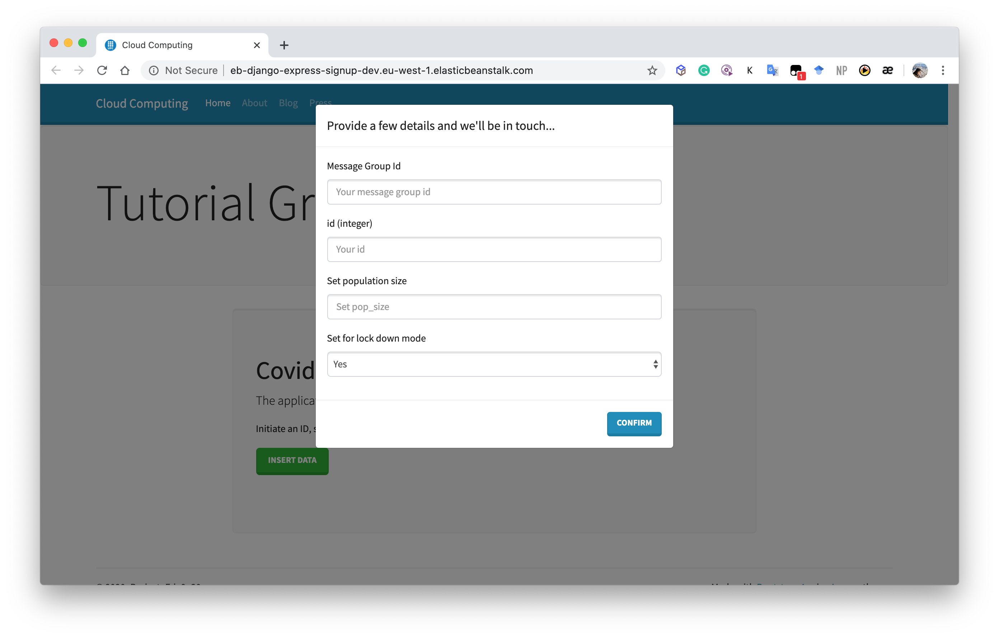

# Cloud Computing Project Challenge (*Sprint 03*)

## Members:
- ariston.harianto.lim@est.fib.upc.edu
- yu-hsuan.chen@est.fib.upc.edu
- haonan.jin@est.fib.upc.edu
- yalei.li@est.fib.upc.edu
- manh.hung.nguyen@est.fib.upc.edu

## 1. SQS message queue
In order to better connect our client with our simulation application, we deploy a Django website with Elastic Beanstalk. Here, we refer [SQS](https://github.com/CCBDA-UPC/Research-projects-2020/tree/master/05_SQS) tutorial to integrate the website with SQS service. In the case of this step, Python (boto3) has the necessary libraries to operate SQS services without any problem.

To be more specific, we deploy an AWS Beanstalk environment to host a web application which will ask for demanded simulation parameters to run the simulation in backend EC2. The information will be sent to the SQS queue which will launch a new instance in the auto scaling group in order to process each request.

With the help of AWS SQS, the website traffic can be automatically managed with FIFO setting and auto scaling operation in the later phrase. Details Django application settings can be found in the [eb-django-express-signup-base-master](eb-django-express-signup-base-master) folder.

First, we establish a [Django website](http://eb-django-express-signup-dev.eu-west-1.elasticbeanstalk.com/) to collect the simulation parameter from clients. 

Then, the website sends the message to SQS on the base of EB. The FIFO queue can help us better manage the simulation orders, and avoid duplications.
 

## 2. Simulation on EC2 instances

## 3. Auto-scaling
