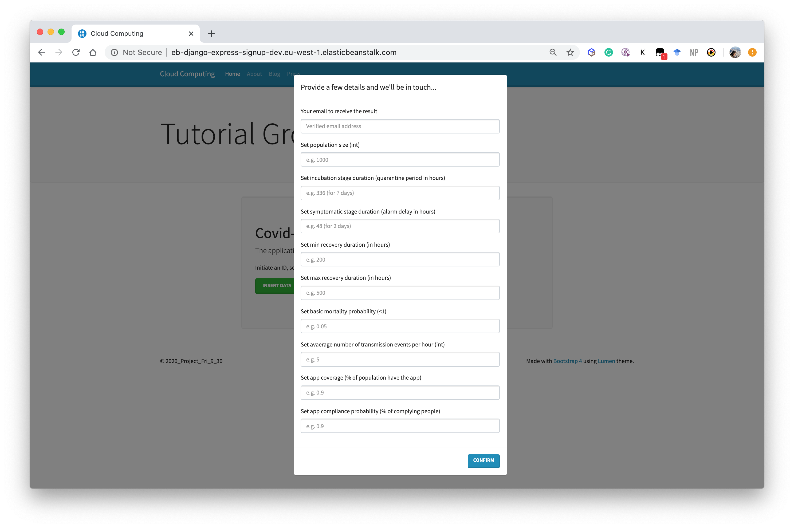
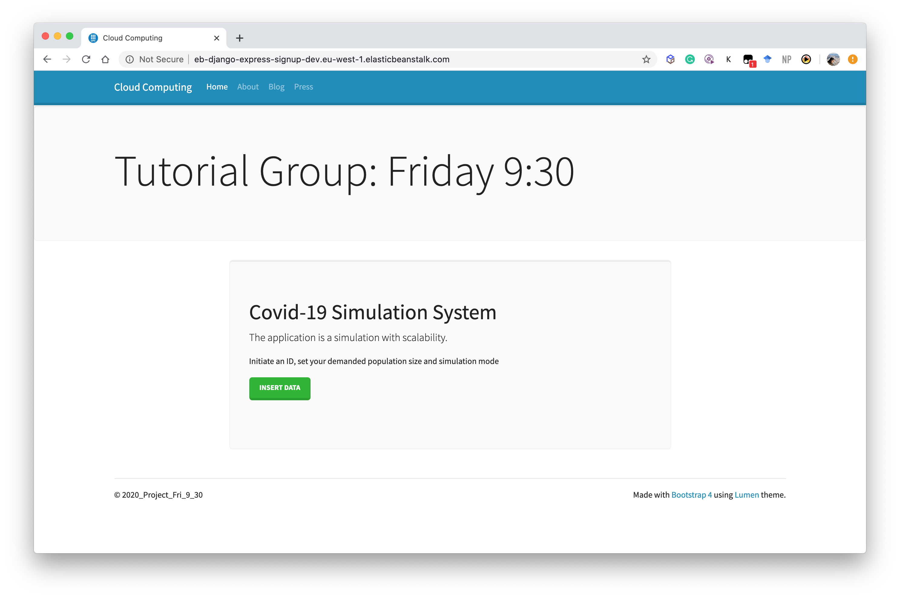
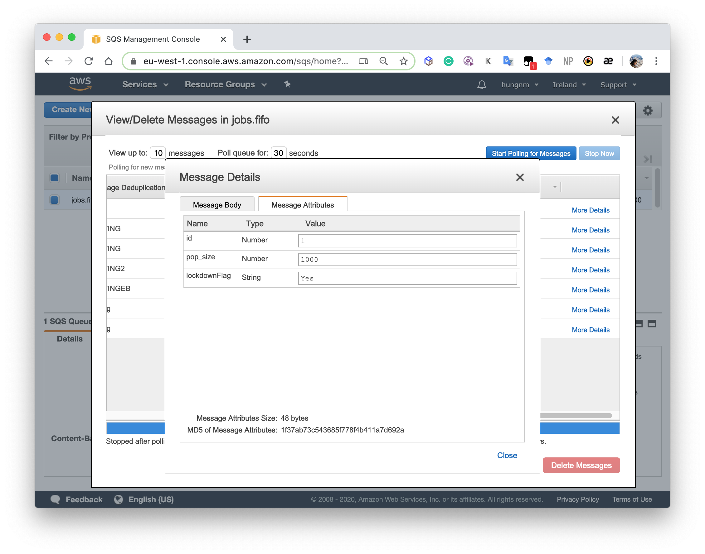
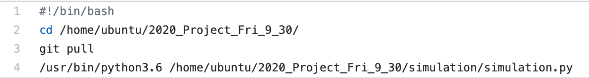
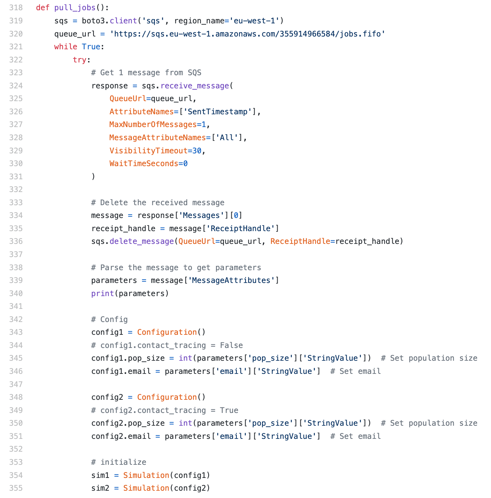
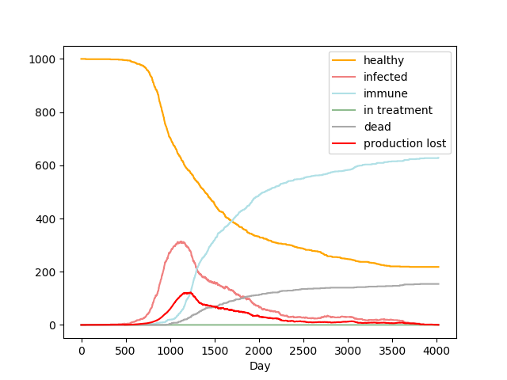
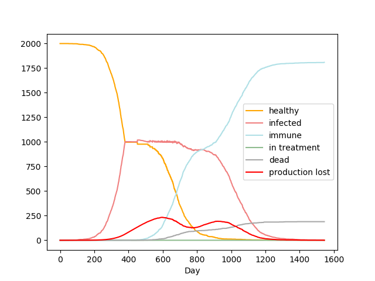
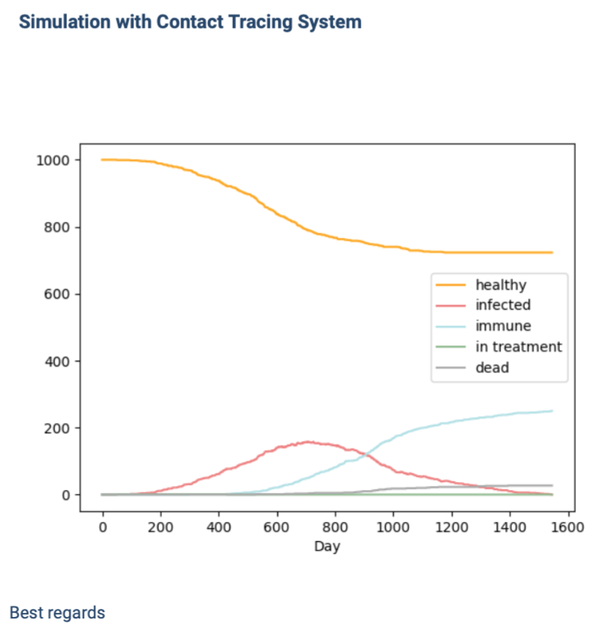

# Cloud Computing Project Challenge (*Sprint 04*)

## Members:
- ariston.harianto.lim@est.fib.upc.edu
- yu-hsuan.chen@est.fib.upc.edu
- haonan.jin@est.fib.upc.edu
- yalei.li@est.fib.upc.edu
- manh.hung.nguyen@est.fib.upc.edu

<p align="center"></p>

## 1. Send a simulation request
### Website
In order to better connect our client with our simulation application, we deploy a Django website with Elastic Beanstalk. Here, we refer [SQS](https://github.com/CCBDA-UPC/Research-projects-2020/tree/master/05_SQS) tutorial to integrate the website with SQS service. In the case of this step, Python (boto3) has the necessary libraries to operate SQS services without any problem.

To be more specific, we deploy an AWS Beanstalk environment to host a web application which will ask for demanded simulation parameters to run the simulation in backend EC2. The information will be sent to the SQS queue which will launch a new instance in the auto scaling group in order to process each request.

With the help of AWS SQS, the website traffic can be automatically managed with FIFO setting and auto scaling operation in the later phrase. Details Django application settings can be found in the [eb-django-express-signup-base-master](eb-django-express-signup-base-master) folder.

First, we establish a [Django website](http://eb-django-express-signup-dev.eu-west-1.elasticbeanstalk.com/) to collect the simulation parameter from clients. 



Then, the website sends the message to SQS on the base of EB. The FIFO queue can help us better manage the simulation orders, and avoid duplications.
 



## 2. Run the simulation on EC2
Once an EC2 instance started, the scheduled script is run to get the latest code and configuration to run


<p align="center"></p>

Then it starts pulling a new message from the given SQS url to get simulation parameters and running 02 simulations with and without the Contact Tracing System (CTS) to evaluate the efficiency of CTS. After successfully processed a message, we deleted it from the SQS queue.

<p align="center"></p>


### Contact Tracing
With further development from the previous simulation model, we add contact tracing mode by fine tuning some specific class. Details can be found in the [simulation](simulation) folder

For `population.py`, we initiate the matrix with 17 columns. Specificly, we added 2 more column for the contact tracing app:
    * 15 : quarantined flag after receiving app alarm (contact tracing)
    * 16 : quarantine since

For `infection.py`, we regularly check the whole population for sick and healthy, which are location-based infection (i.e. check the individual physical indicator for infected probability, based on those who has been within the infection area of a confirmed case).
 
 We further assume that people will be self-quarantined for 14 days (i.e. `incubation_stage_duration = 336`) after their contact are confirmed infected. Here, we assume that defaultly it will take 2 days for patients to show symptom (i.e. `symptomatic_stage_duration = 48`), which will delay the alarm sent to the nearby contact.  

For those confirmed cases, if there is healthcare capacity (i.e. `healthcare_capacity = 300`), they will be marked as 'in treatment', and isolated in the hospital area. 

For those self-quarantined people, we will set their mobility to 0, and cannot be infected by others again within the quarantine. After 14 days, we will check recover/infected, and set their mobility accordingly.   

Besides, in order to test the necessity of the app, we introduce 2 more parameters: `app_installed_probability` and    `contact_tracing_compliance` to set the amount of people actually comply with self-quarantine. 

For `config.py`, simulation parameters can be set for different scenarios of contact tracing: 

```python
    def set_contact_tracing(self, app_installed_probability, contact_tracing_compliance,
                            symptomatic_stage_duration, incubation_stage_duration,
                            isolation_bounds=[0.02, 0.02, 0.09, 0.98]):
        '''sets contact tracing to active'''

        self.contact_tracing = True
        self.symptomatic_stage_duration = symptomatic_stage_duration
        self.incubation_stage_duration = incubation_stage_duration

        #fraction of the population that will obey the lockdown
        self.app_installed_probability = app_installed_probability
        self.contact_tracing_compliance = contact_tracing_compliance
        self.isolation_bounds = isolation_bounds
        # set roaming bounds to outside isolated area
        self.xbounds = [0.1, 1.1]
        self.ybounds = [0.02, 0.98]
```

As for local testing result, direct graphs are shown below:
* Simulation with Contact Tracing App

* Simulation without Contact Tracing App


Statistically, the results are as below:
```
[Population = 1000]
Contact Tracing 
(app_installed_probability=1, contact_tracing_compliance=1)
total timesteps taken: 2769
total dead: 125
total recovered: 1329
total infected: 0
total infectious: 0
total unaffected: 546

*****************

No Contact Tracing
total timesteps taken: 1601
total dead: 173
total recovered: 1821
total infected: 0
total infectious: 0
total unaffected: 6
```

Generally, with the contact tracing app, the infection curve is flatened, and the death rate is lower. A large amount of people are not affected at all.
 
## 3. Send results to the clients via email

### S3 bucket

The resulting plot (statistic) generated after got the request from the client. One client can run many simulations, so the different results will be made according to the parameters they enter on the website.
The images that are going to present to the client will be upload to the S3 bucket with a unique name(timestamp).

### AWS SES

The final result will be sent to the client's mailbox by AWS SES right after the simulation finish. However, the SES service is mainly used for sending the text, even though we can use base 64 to encode the pictures to put in inline in HTML, in most web email browser, it does not support presenting the image in this way. So we eventually use the link of file on the S3 bucket. In this case, the client is allowed to download the picture but cannot access the bucket from the mail.

<p align="center"></p>
<p align="center"></p>
