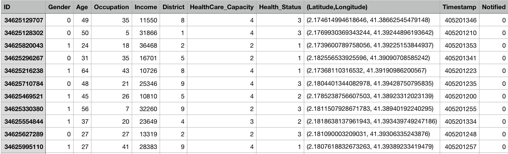

# Cloud Computing Project Challenge (*Sprint 01*)

## Members:
- ariston.harianto.lim@est.fib.upc.edu
- yu-hsuan.chen@est.fib.upc.edu
- haonan.jin@est.fib.upc.edu
- yalei.li@est.fib.upc.edu
- manh.hung.nguyen@est.fib.upc.edu

## **1. Data generation**
### Method
We generate CSV file and trigger the S3 to upload the file to the bucket with the lambda_function.py

### Explanation of dataset

Randomy generate following data:
```
1. ID: Phone number (Unique)
2. Gender: 1 Male, 0 Female
3. Age
4. Occupation: 1-50 tags of occupation. e.g. 23 = Software Engineer
5. Income: Based on the Spain average salary by standard normal distribution
6. District:The main districts in Barcelona 
   1=Ciutat Vella, 2=L'Eixample, 3=Sants-Montjuïc, 4=Gràcia, 5=Les Corts, 
   6=Sarri Sant Gervasi, 7=Horta Guinard, 8=Nou Barris, 9=Sant Andreu, 10=Sant Mart
7. Health Care Capacity: Control approaches.
   1=Business As Usual , 2=Reduced Interaction , 3=Lock-Down ,4=Self-Isolation
8. Health Status: 
   1=Healthy, 2=Infected , 3=Recovered , 4=Dead (Random generate with weight:50,25,20,5 respectly)
9. Location(Latitude,longitude) Barcelona 41.3851° N, 2.1734° E. with random generate digits follow 
10. Timestamp：Random generate timestem e.g 405201346 （date:month:year:hour:sec)
11. Notified: initially 0, if the notification sent then it will become 1
```

<p align="center"></p>


## **2. Simple simulation**
With refer to the virus spread model from [paulvangentcom](https://github.com/paulvangentcom/python_corona_simulation), we will simulate the infection model based on our previous generated population data. The desired result will be shown as below:


To achieve this goal, several modules will be used, including [`infection.py`](https://github.com/paulvangentcom/python_corona_simulation/blob/master/infection.py), [`path_planning.py`](https://github.com/paulvangentcom/python_corona_simulation/blob/master/path_planning.py), and [`simulation.py`](https://github.com/paulvangentcom/python_corona_simulation/blob/master/simulation.py).
Besides, we will develop the following parameters to better assist our simulation.

### Parameter settings
#### Population configuration

Based on the generated data, we will distribute them within a coordinate system based on their geo locations. Together with pre-assigned attributes, we will also assign them with their daily schedules (based on their destinations). In order to reflect different case scenarios, different wandering range will be assigned (i.e. reduced motion area with strict regulations).

Details are shown as below:
```python
 '''initialized the population for the simulation
    the population matrix for this simulation has the following columns:
    0 : unique ID
    1 : current x coordinate
    2 : current y coordinate
    3 : current heading in x direction
    4 : current heading in y direction
    5 : current speed
    6 : current state (0=healthy, 1=sick, 2=immune, 3=dead, 4=immune but infectious)
    7 : age
    8 : infected_since (frame the person got infected)
    9 : recovery vector (used in determining when someone recovers or dies)
    10 : in treatment
    11 : active destination (0 = random wander, 1, .. = destination matrix index)
    12 : at destination: whether arrived at destination (0=traveling, 1=arrived)
    13 : wander_range_x : wander ranges on x axis for those who are confined to a location
    14 : wander_range_y : wander ranges on y axis for those who are confined to a location
```   

To be specific, the daily schedule will be simplified by how many destinations the person visit that day.
```python
def initialize_destination_matrix(pop_size, total_destinations):
    '''intializes the destination matrix
    function that initializes the destination matrix used to
    define individual location and roam zones for population members
    Keyword arguments
    -----------------
    pop_size : int
        the size of the population
    total_destinations : int
        the number of destinations to maintain in the matrix. Set to more than
        one if for example people can go to work, supermarket, home, etc.
    '''

    destinations = np.zeros((pop_size, total_destinations * 2))

    return destinations
```

#### Population mobility

Individual mobility will be set by `go_to_location`, where arrived person will be `keep_at_dest`. 
The whole population will be monitored based on the active destinations `check_at_dest`. It can assist later in defining the infected region if one person is confirmed infected in that cluster.

```python
def go_to_location

def check_at_destination

def keep_at_destination
```

### Infection model

Basically, if one person is confirmed infected, those who were in close contact (`near_by`) will be marked, and infected by infection_chance (`infect`).
 
```python
def find_nearby(population, infection_range)

def infect(population, infection_range, infection_chance)
```

After being infected, the health state will be changed into `recover_or_die`. Recover will be updated after observation_period, and death rate will be age dependent, and treatment dependent.

```python
def recover_or_die(population):
    '''
    recovery_duration
    morality_chance(default_morality, risk_age, treatment_factor)
    '''
```

### Contact tracing model

With further reference to [`johntmyers`](https://github.com/gretelai/contact-tracing-experiment) implementation of `Apple + Google Contact Tracing`, we plan to include the contact tracing function in the later stage to show whether this function can help flat the curve.

Generally, we will assign each person with a `Hnadset ID` to track their locations for each hour (whether locations will be assigned with `Daily tracing ID`). Whenever a person updates his/her health state into 'Confirmed', those who has been to the same location at the same time will be alerted, and update status into 'Infected'. Self-quarantine will be assumed.

Preliminary report from a single confirmed person will be look like:
```
Simulation Start Time: 2020-04-13T07:00:00

Family Count: 5
Friend Count: 14
Coworker Count: 30
Other Count: 92

--------------------
Handset ID: bafbf7a027b9426189eba09667ae231c
Relation to subject: family [SIMULATION DATA ONLY, would not be revealed real-world] 
Contact periods:
		2020-04-13T17:00:00
		2020-04-14T09:00:00
		2020-04-17T18:00:00
--------------------
Handset ID: 867879dcdced4a4681b271c3518bc4c4
Relation to subject: coworker [SIMULATION DATA ONLY, would not be revealed real-world] 
Contact periods:
		2020-04-13T12:00:00
		2020-04-15T12:00:00
		2020-04-23T13:00:00 
--------------------
...

```
## **3. Visualization**

We wanted a visualization to track the evolution of the infection (number of cases, number of deaths, etc) updated in 
real-time whenever there is new data. To do this, we use the `animation` function of `matplotlib`. The code can be
found at `matplotlibAnimation.py`. 

This is what it looks like.  


