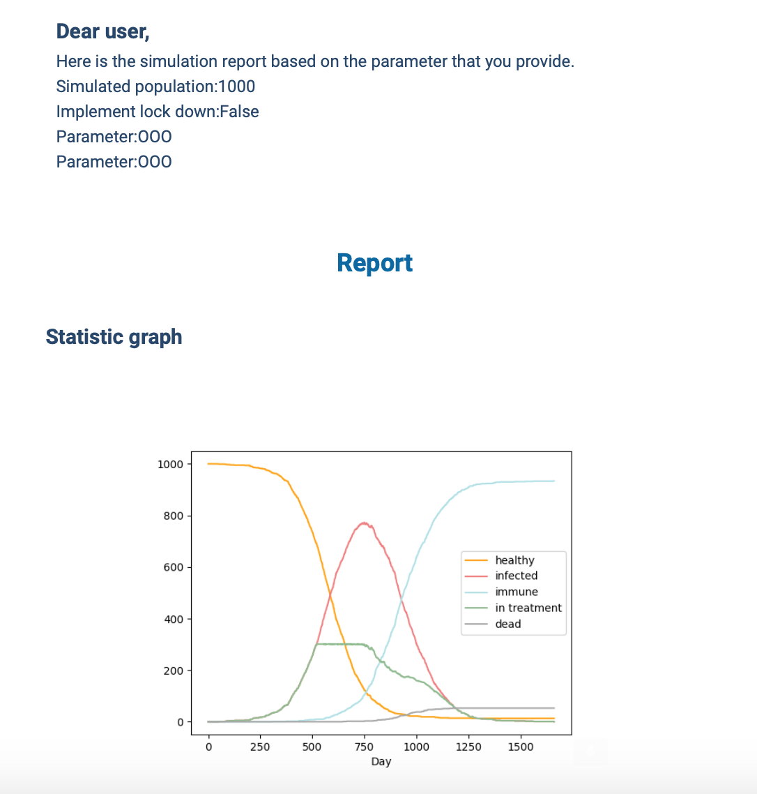
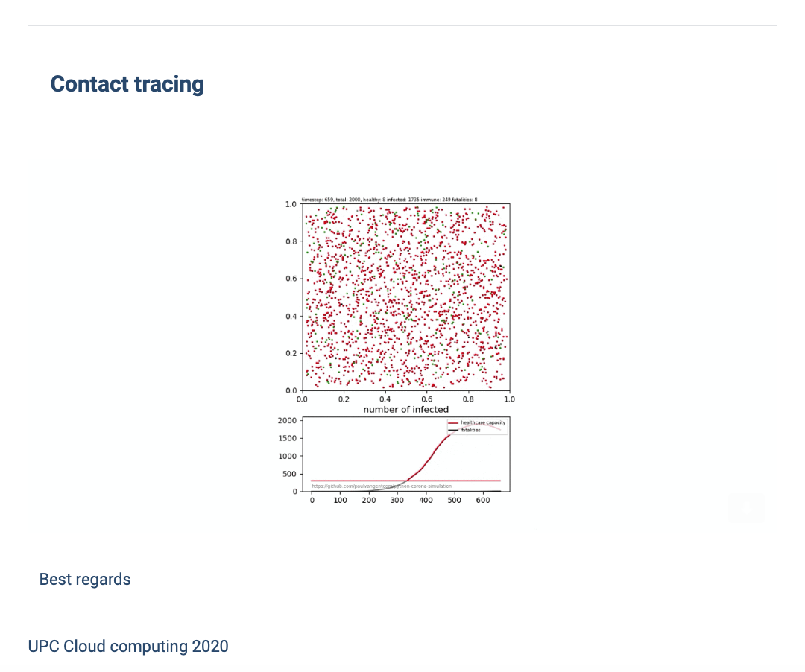

# Cloud Computing Project Challenge (*Sprint 03*)

## Members:
- ariston.harianto.lim@est.fib.upc.edu
- yu-hsuan.chen@est.fib.upc.edu
- haonan.jin@est.fib.upc.edu
- yalei.li@est.fib.upc.edu
- manh.hung.nguyen@est.fib.upc.edu

## 1. Send a simulation request
### Website
## 2. Run the simulation on EC2
### Contact Tracing
## 3. Send results to the clients via email

### S3 bucket

The resulting plot (statistic) generated after got the request from the client. One client can run many simulations, so the different results will be made according to the parameters they enter on the website.
The images that are going to present to the client will be upload to the S3 bucket with a unique name(timestamp).

### AWS SES

The final result will be sent to the client's mailbox by AWS SES right after the simulation finish. However, the SES service is mainly used for sending the text, even though we can use base 64 to encode the pictures to put in inline in HTML, in most web email browser, it does not support presenting the image in this way. So we eventually use the link of file on the S3 bucket. In this case, the client is allowed to download the picture but cannot access the bucket from the mail.

