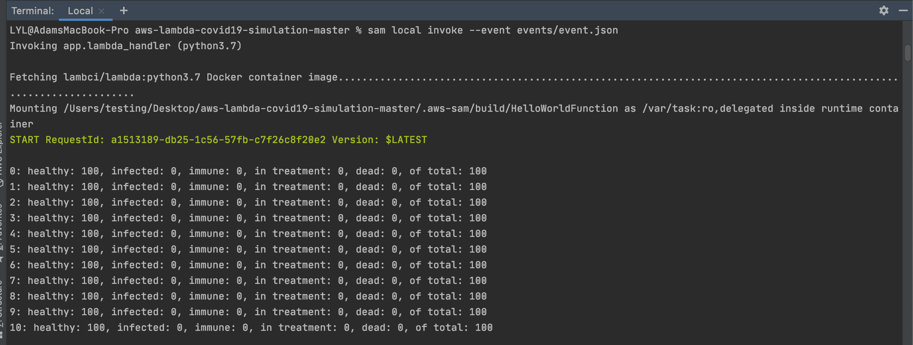
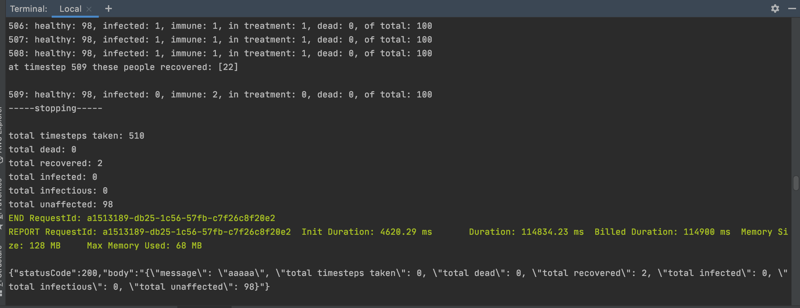
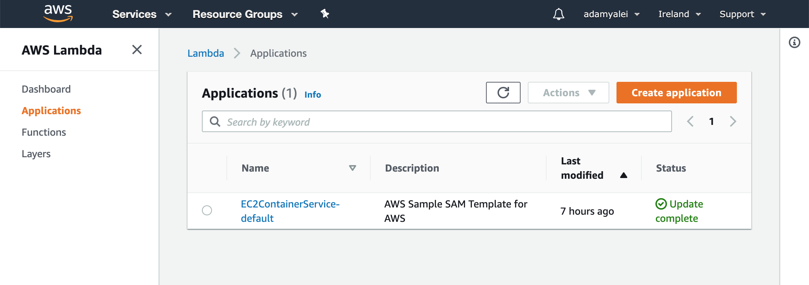
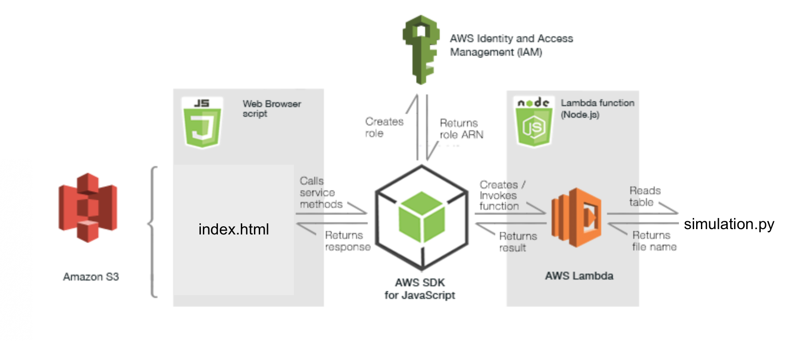
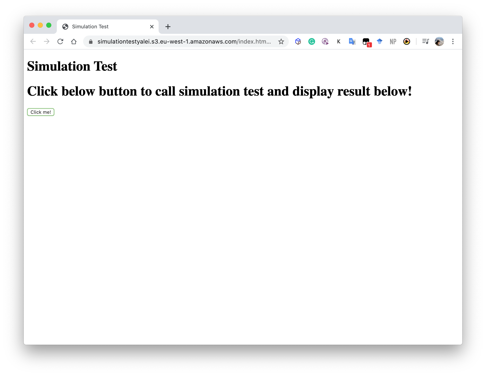

# Cloud Computing Project Challenge (*Sprint 02*)

## Members:
- ariston.harianto.lim@est.fib.upc.edu
- yu-hsuan.chen@est.fib.upc.edu
- haonan.jin@est.fib.upc.edu
- yalei.li@est.fib.upc.edu
- manh.hung.nguyen@est.fib.upc.edu

#### Table of contents

- [1. Lambda function for data generation](#1.-Lambda-function-for-data-generation)
    - [Data Generation by Lambda Function and S3](#Data-Generation-by-Lambda-Function-and-S3)
    - [Explanation of dataset](#Explanation-of-dataset)
- [2. Lambda function for simulation](#2.-Lambda-function-for-simulation)
    - [Locally deploy AWS Lambda function](#Locally-deploy-AWS-Lambda-function)
    - [Using AWS SDK for JavaScript to Call Lambda Functions](#Using-AWS-SDK-for-JavaScript-to-Call-Lambda-Functions)
        - [Prerequisites](#Prerequisites)
        - [Connect browser script with Lambda function](#Connect-browser-script-with-Lambda-function)

## 1. Lambda function for data generation
### Data Generation by Lambda Function and S3
Based on the local data generation code and dataset desgin thinking(Report-Srpint01.md), we generate data by AWS Lambda function and store data in S3. Finally, we make some configuration and share S3 dataset to every teammembers.


In order to make the connection bewteen Lambda function and S3 and store dataset to S3, we need to configure S3 trigger.


Run local gata genration code in lambda functions and make use of "hello world" format to test code.


Configure permission in S3 by AWS email account thus making every team member share S3 dataset

### Explanation of dataset

Randomy generate following data:
```
1. ID: Phone number (Unique)
2. Gender: 1 Male, 0 Female
3. Age
4. Occupation: 1-50 tags of occupation. e.g. 23 = Software Engineer
5. Income: Based on the Spain average salary by standard normal distribution
6. District:The main districts in Barcelona 
   1=Ciutat Vella, 2=L'Eixample, 3=Sants-Montjuïc, 4=Gràcia, 5=Les Corts, 
   6=Sarri Sant Gervasi, 7=Horta Guinard, 8=Nou Barris, 9=Sant Andreu, 10=Sant Mart
7. Health Care Capacity: Control approaches.
   1=Business As Usual , 2=Reduced Interaction , 3=Lock-Down ,4=Self-Isolation
8. Health Status: 
   1=Healthy, 2=Infected , 3=Recovered , 4=Dead (Random generate with weight:50,25,20,5 respectly)
9. Location(Latitude,longitude) Barcelona 41.3851° N, 2.1734° E. with random generate digits follow 
10. Timestamp：Random generate timestem e.g 405201346 （date:month:year:hour:sec)
11. Notified: initially 0, if the notification sent then it will become 1
```

<p align="center"></p>

## 2. Lambda function for simulation

### Locally deploy AWS Lambda function

Here, we use PyCharm with AWS Toolkit to locally construct the program and testing. We refer to [AWS official documents](https://docs.aws.amazon.com/serverless-application-model/latest/developerguide/serverless-sam-cli-install-mac.html) to set up the configurations, featuring AWS SAM.

Basically, we performed the following steps to set local environment:
1. **Install Docker**: This allows us to run containers on our macOS machines. AWS SAM provides a local environment that's similar to AWS Lambda to use as a Docker container. We can use this container to build, test, and debug our serverless applications.

    1. Install Docker Desktop
    2. Configure shared drives
    3. Verify the installation
    
2. **Install AWS SAM CLI**: 
```
brew tap aws/tap
brew install aws-sam-cli
```

After the that, we further followed another [instruction](https://medium.com/@fgriasa123/%E4%BD%BF%E7%94%A8pycharm%E5%B0%87%E5%87%BD%E6%95%B8%E9%83%A8%E7%BD%B2%E5%88%B0aws-lambda-aa6835d39b93) to use PyCharm to deploy the Lambda function to AWS.

Steps can be summarized as below:
1. Install AWS Toolkit in PyCharm.


2. Create new project of AWS Serveless Application, and use `Hello World` template.


3. Configure AWS environment: AWS credentials.


4. Locally test the Lambda function in command line.

```buildoutcfg
sam build --use-container
sam local invoke --event testEvent.json
```

Results should be:



5. Deploy to AWS.


After successful deployment, we can view the application in CloudFormation, which contains Lambda functions.


### Using AWS SDK for JavaScript to Call Lambda Functions
With reference to [aws official documentation](https://docs.aws.amazon.com/sdk-for-javascript/v2/developer-guide/using-lambda-functions.html), we use AWS JavaScript SDK to deploy and call AWS Lambda functions, where the simulation.py is run in the cloud environment. 

Basically, we perform the following:
* Create and deploy AWS Lambda functions in PyCharm with AWS SAM CLi;
 
* Call Lambda functions from JavaScript running in a web browser.

* Call another service within a Lambda function and process the asynchronous responses before forwarding those responses to the browser script.

* Use Node.js scripts to create the resources needed by the Lambda function.

The diagram illustrate most of the elements in this simulation application and how they relate to one another. 



#### Prerequisites

1. Install Node.js locally to run various scripts that help set up the Amazon S3 bucket, and create and configure the Lambda function. The Lambda function itself runs in the AWS Lambda Node.js environment. (node is pre-installed in the testing machine).

2. Install AWS SDK for JavaScript locally to run the setip scripts.
```buildoutcfg
npm install aws-sdk
```

Successful install shows:
```buildoutcfg
npm WARN deprecated buffer@4.9.1: This version of 'buffer' is out-of-date. You must update to v4.9.2 or newer
npm notice created a lockfile as package-lock.json. You should commit this file.
npm WARN slotassets No description
npm WARN slotassets No repository field.
npm WARN slotassets No license field.

+ aws-sdk@2.672.0
removed 1 package, updated 1 package and audited 17 packages in 2.708s
found 0 vulnerabilities
```

#### Connect browser script with Lambda function
Main structure is referred to [AWS official tutorial](https://github.com/awsdocs/aws-doc-sdk-examples/blob/master/javascript/example_code/lambda/tutorial/slotassets.zip) with modification. Detailed steps are shown below:

1. Create a JSON file `config.json` with the account credentials in the working directory. The content follows content:

```buildoutcfg
{ "accessKeyId": <YOUR_ACCESS_KEY_ID>, "secretAccessKey": <YOUR_SECRET_ACCESS_KEY>, "region": "us-east-1" }
``` 

This file is used by the setup scripts to authenticate their AWS requests, using the following command:
```buildoutcfg
AWS.config.loadFromPath('./config.json');
```

2. **Create an Amazon S3 bucket configured as a static website.** Here, we will use the bucket to store all the browser assets, including HTML files, and the CSS files. It is configured as a static website so that it also serves the application from the bucket's URL.

```buildoutcfg
node s3-bucket-setup.js sdktestingyalei
```

Successful result:
```buildoutcfg
Bucket URL is  /sdktestingyalei 
Success {}
```

The bucket URL will be used later.

3. **Prepare the browser script.** Save the edited copy of `index.html` for upload to Amazon S3.

    1. We first need to **prepare an Amazon Cognito Identity Pool.** The JavaScript code in the browser script needs authentication to access AWS services. Within webpages, we typically use Amazon Cognito Identity to do this authentication. Details can be found in [AWS official document](https://docs.aws.amazon.com/sdk-for-javascript/v2/developer-guide/using-lambda-browser-script.html). 
    We get the AWS credentials as following:
    
    
    2. **Edit the browser script.** Here, we first develop a simple `index.html` for running the test result of Lambda function. We need to add the Cognito Identity Pool for the page authentication.
    
    ```buildoutcfg
    AWS.config.credentials = new AWS.CognitoIdentityCredentials({IdentityPoolId: 'IDENTITY_POOL_ID'});
    ```

    3. **Call Lambda function within the browser.** We use `lambda.invoke` to call the lambda function to run our simulation.
    
    ```
    var params = {
        FunctionARN: 'function', /* required */
        ClientContext: 'Null',
        InvocationType: Event | RequestResponse | DryRun,
        LogType: None | Tail,
        Payload: Buffer.from('...') || 'STRING_VALUE' /* Strings will be Base-64 encoded on your behalf */
    };
    
    function callAwsLambdaFunction() {
        lambda.invoke(params, function(err, data) {
            if (err) console.log(err, err.stack); // an error occurred
            else console.log(data);           // successful response
        })
    };
    ``` 

4. **Run the Lambda.** We upload the `index.html` to S3 buckt, and run the lambda function thru the webpage.

Initial page: 


After click the button:
`NOT RESPONDING` 
Potential reason: Lambda function running for too long.


