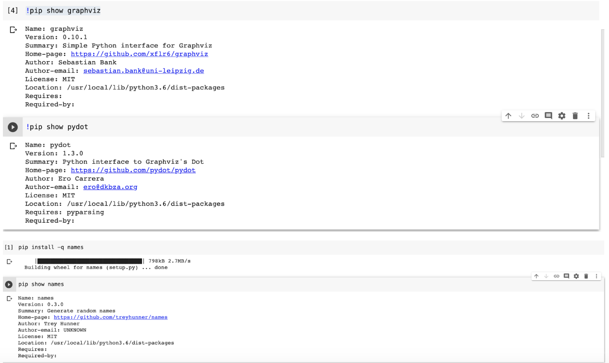
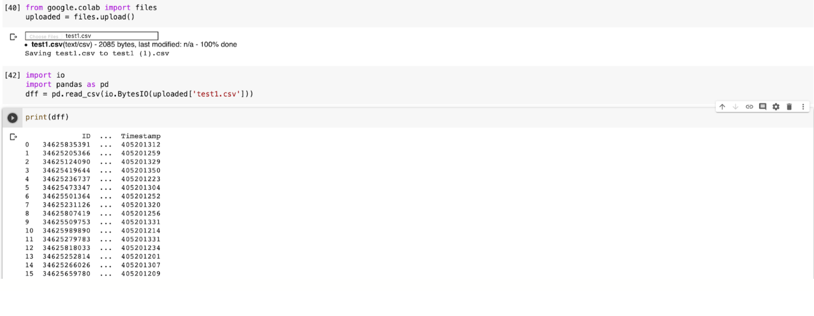
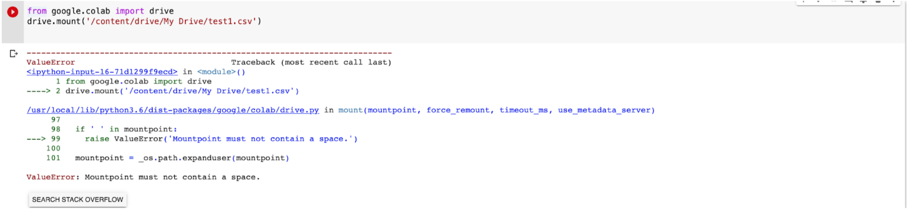
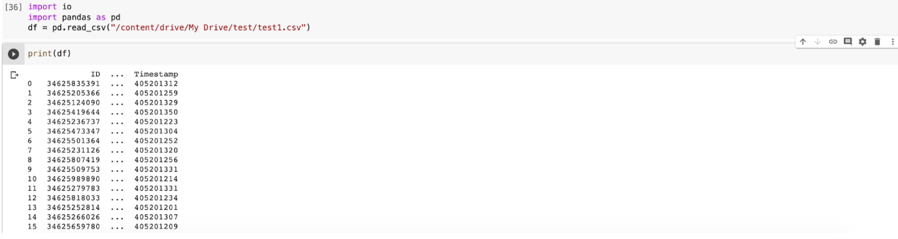
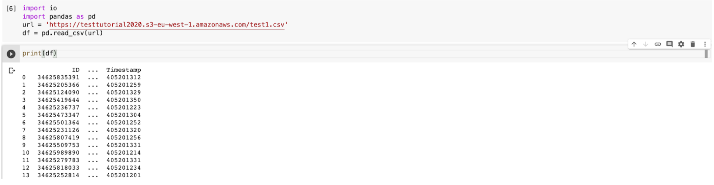
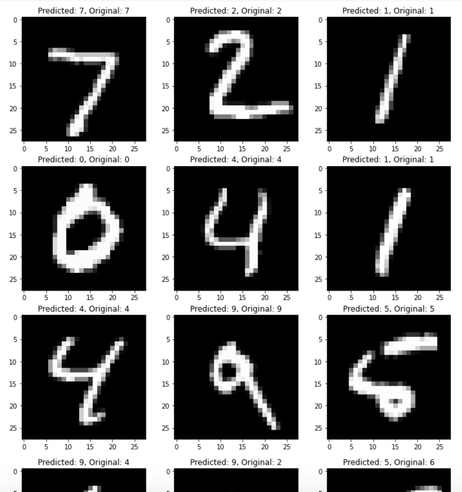
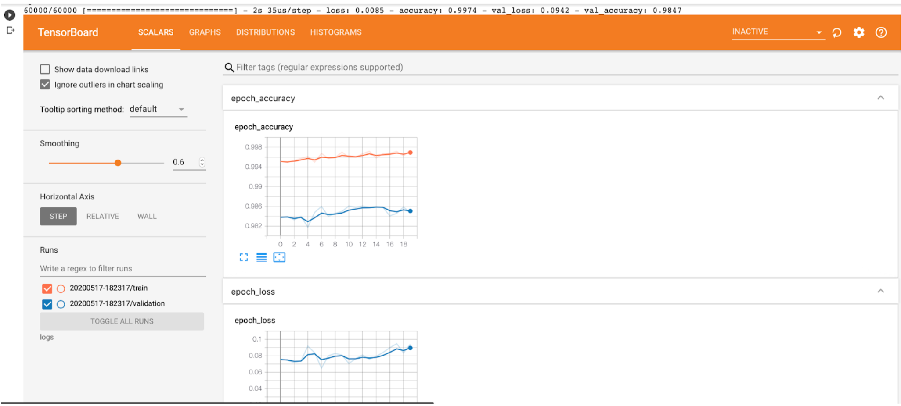

## Q1. Install graphviz and pydot library not in google Colab by default. What syntax worked for each library? Try to install any other library. Give screenshots of the successful install and version in your response.
```!pip install -q pydot``` are able to import both graphviz and pydot. 
<p align="center"></p>

## Q2. Try the three methods for uploading data to Colab. Add screenshots to the response file.
##### From Local machine:
<p align="center"></p>
##### From Google drive:
I encountered some errors as follows by following the tutorial.
<p align="center"></p>

But it would work if I change to the following code. As In the mount can only access until drive (Perhaps is like the error description saying that the space are not allow, but “My Drive” contains space
<p align="center"></p>

##### From link to external source:
Here we create a public AWS S3 bucket, https://testtutorial2020.s3-eu-west-1.amazonaws.com/test1.csv
<p align="center"></p>

## Q3: At this step, verify the dimensions of the train set, test set, and corresponding class labels by printing them. Take a screenshot of the result and add it in your response. How do the converted class labels of lists of binary variables make sense to you?

<p align="center"></p>

## Q4: How much accuracy have you got? Is it satisfactory to you? If not, what could be done as a step to improve the accuracy?

<p align="center"></p>

I think the accuracy is pretty high. 

## Q5: Add a screenshot of the TensorBoard dashboard showing your training profiles.

<p align="center"></p>


#### Feedback: 
In general, the idea is interesting, and the tutorial is well-structured and easy to follow. Still, it will be better if the description of the question can be more explicit such as  "the dimensions of the trainset" in Q3; the definition of dimension is vague as it has several meanings in this domain.  In Q4, it would be nice to know the ideal accuracy to obtain because everyone's standard of satisfying accuracy is different. For example, 98% is pretty high for me that I wouldn't feel like do further research for the topic. Overall, as I see that you did a good job with a detailed explanation for each step, so you deserve ______.
