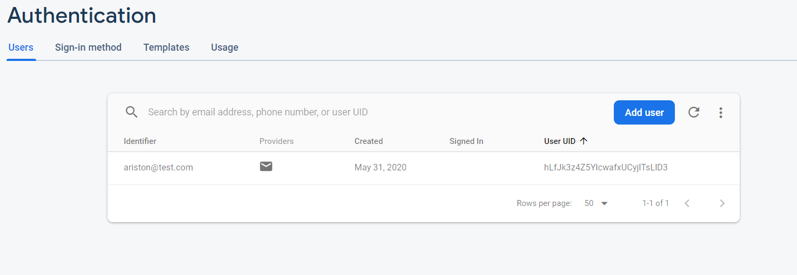

# Connecting Android Application to Firebase

## Task 1

### Q1.1 Were you successful ? Did you have any challenges ?
Yes. No problem.

### Q1.2 Did you decide to use your actual mobile or did you setup an emulator?
I used a simulator

### Q1.3 Were you successful ? Did you have any problems? If yes, how did you solve them?
Yes. Had to do an additional installation of API 28 SDK, but otherwise everything works perfectly.

## Task 2

### Q2.1 Did you manage to successfully connect your app to Firbase ? Were there any problems? If yes, how did you solve them?
Yes. No problem.

## Task 3

### Q3.1 Now go to Firebase, specifically to the authentication page, what do you see? What changed? Share a screenshot with your newly regisetred username on Firebase.

There is a username stored on the firebase based on what I inputted on the app.

### Q3.2 Close the app, open it again, attempt to login with the user you registered. Were you successfull?
Yes.

### Q3.3 Explain what the above functions registerUser() and loginUser() do.
registerUser() creates a new entry on the Firebase database. 
loginUser() checks the input against the database; if the username is registered, user will be able to log-in.

### Q3.4 Do a little research and elaborate on other sign in methods that Firebase provides to Android Applications. Just explain, you do NOT need to implement these methods.
Through google email, Facebook, Microsoft account, or Apple accounts.

## Task 4

### Q4.1 Change the name to your name in the firebase database. Now look at the items in the app. What happened ? Did anything change?
Yes. The items changed according to the corresponding name.

### Q4.2 Elaborate on the functionality of the above code? how does it work ?
The method is invoked everytime there is an update. The function takes the new values and updates the database with the new values.

### Q4.3 If we were to delete items, and therefore need them to be deleted from the firebase realtime database, what do we need to use in Android? Do a little search and explain what you found. You do NOT need to implement those.
First, we need to find the key to the node that we want to delete. So, we need to query the database to with the matching parameter that we want. Once we have the key, we can just delete the child node with that particular key.

### Q4.4 How much time did you spend on this tutorial? what diffculties did you face?
About 4-5 hours. Mostly in setting up the emulator and connecting it to the firebase which takes a bit of time.

### Q4.5 Did you find the session interesting?
Yes.

## Feedback
Overall the tutorial is interesting. It provides a cloud-hosted database alternative to AWS which is very useful to avoid vendor-locking.
Steps are easy to follow with clear instructions. I did not have any meaningful difficulties in finishing the tutorial. Firebase is also a very easy
tool to use. I would love to explore more about using Firebase from other source, not just from an Android app.
I would give this tutorial a 9/10.
